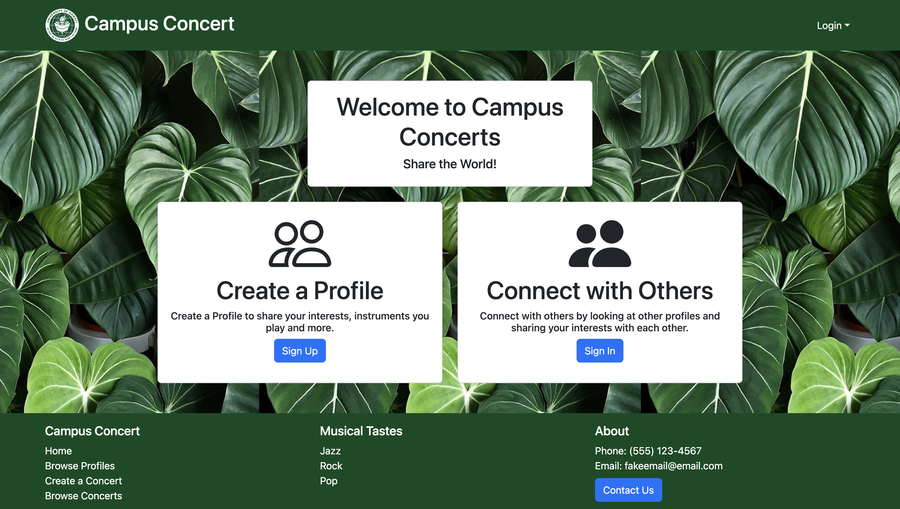
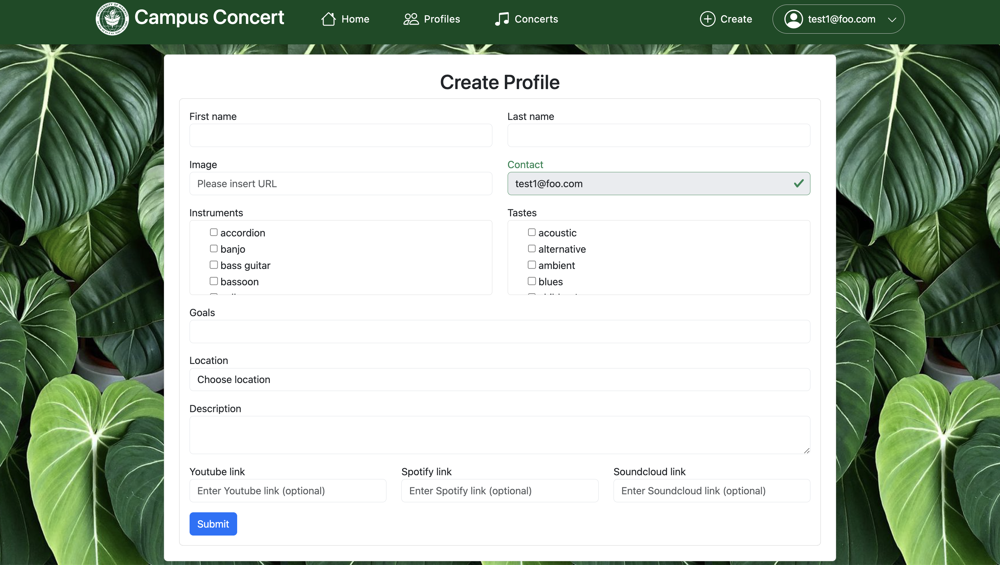
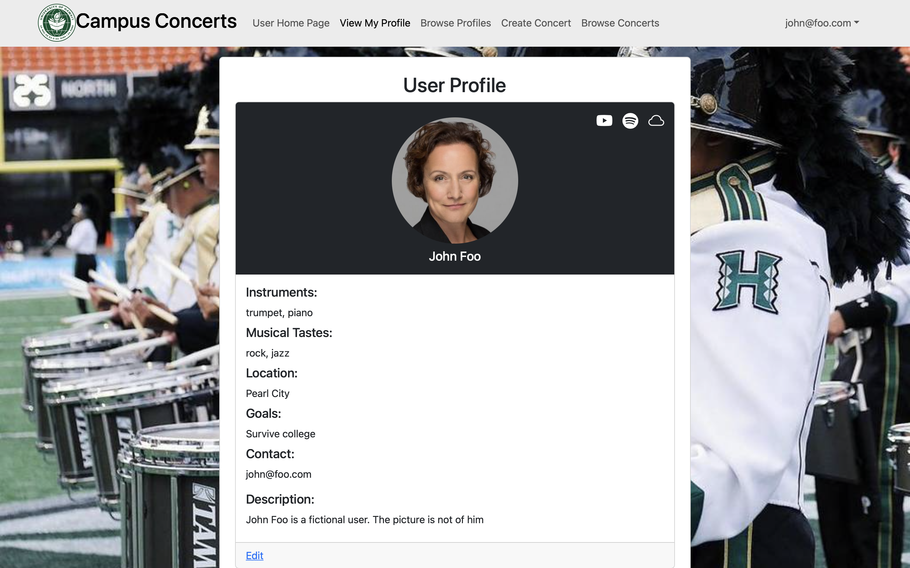
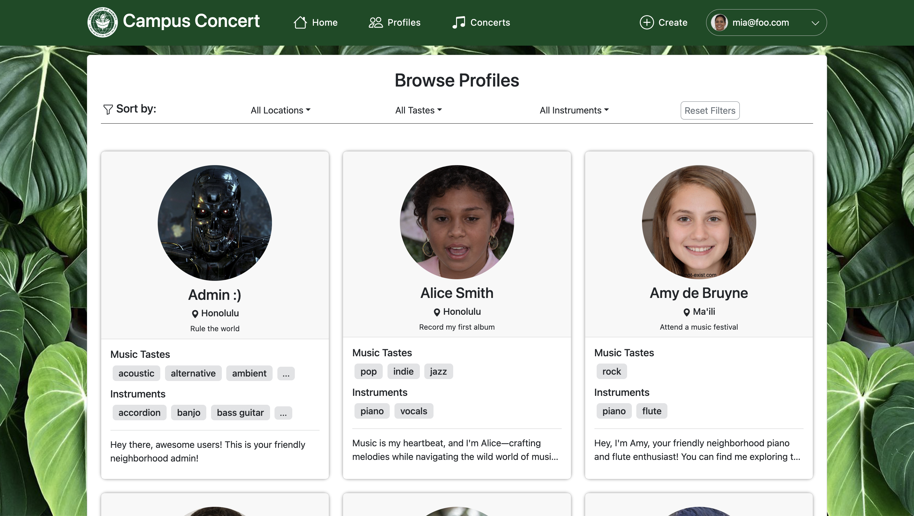

# Campus Concert
[](https://opensource.org/licenses/MIT)


Check out the app here: [campus-concert.com](https://campus-concert.com/)
## Table of contents

* [Overview](#overview)
* [User Guide](#user-guide)
* [Developer Guide](#developer-guide)
* [Development History](#development-history)
* [Deployment](#deployment)
* [Community Feedback](#community-feedback)
* [Team](#team)

## Overview

Campus Concert is a web application that allows musicians on campus to connect with each other. Students with musical talents will have the ability to easily discover like-minded peers, form connections based on shared musical tastes and abilities, and collaboratively engage in musical activities. 

This application aims to provide users the following features:
* Personalized profiles highlighting their instrumentation, musical tastes, and capabilities.
* The ability to browse through profiles of other musicians with filtering options based on musical tastes, capabilities, instruments, etc.
* The ability to create and schedule "concerts" or music sessions, including details like location, time, musical type, desired capabilities, and organizer contact information.
* In-app messaging or contact features to facilitate communication between users.

## User Guide

This section will provide a walkthrough of the Campus Concert user interface and its capabilities.

### Landing Page
The welcome page. Allows new users to sign up, and existing users to log in.<br>
[campus-concert.com/](https://campus-concert.com/)


### User Home Page
Displays the options available to the user.<br>
[/userhome](https://campus-concert.com/userhome)


### User Profile Page
#### Create user profile
New users need to create a profile before starting to use the app.<br>
(Access this page by signing up from the landing)

#### View user profile
Users can view their own profile.<br>
[/userprofile](https://campus-concert.com/userprofile)

#### Edit user profile
Users can edit their own profile.<br>
(This URL uses the current profile ID. Access this page by clicking "edit" when viewing own profile.)


### Browse Profiles Page
Users can browse other users' profiles.<br>
[/browse-all-profiles](https://campus-concert.com/browse-all-profiles)


Users can enlarge other users' profiles and send them messages<br>
(This URL uses a profile's ID. Access this page by clicking "View Details" on a profile.)


### Admin Home Page
More admin features will be added in the future.<br>
(Note: you must be logged in as an admin to access this page)<br>
[/adminhome](https://campus-concert.com/adminhome)


## Developer Guide

### Installation

First, [install Meteor](https://www.meteor.com/install).

Second, clone the repository [Campus Concert](https://github.com/campus-consert/campus-consert) to your local computer.

Third, cd into the campus-concert/app directory and install libraries with:

```
$ meteor npm install
```

Fourth, run the system with:

```
$ meteor npm run start
```

If all goes well, the application will appear at [http://localhost:3000](http://localhost:3000).

### Application Technologies

The application is based upon [meteor-application-template-react](https://ics-software-engineering.github.io/meteor-application-template-react/) and the following technologies:
* [Meteor](https://www.meteor.com/) for Javascript-based implementation of client and server code.
* [React](https://reactjs.org/) for component-based UI implementation and routing.
* [React Bootstrap](https://react-bootstrap.github.io/) CSS Framework for UI design.
* [Uniforms](https://uniforms.tools/) for React form design and display.

## Development History

### Milestone 1:

[Milestone 1 Project Board](https://github.com/orgs/campus-concert/projects/2)

- The system is deployed to Digital Ocean
- Landing page
- Mockups of at least four other pages

### Milestone 2:

[Milestone 2 Project Board](https://github.com/orgs/campus-concert/projects/3)

- Create more pages
- Create tests

### Milestone 3:

[Milestone 3 Project Board](https://github.com/orgs/campus-concert/projects/4)

- Implement functionalities to improve user experience
- Clean up

## Deployment:

[https://campus-concert.com/](https://campus-concert.com/)

## Community Feedback:

<b><i>TBD.</i></b>

## Team

[Team Contract](https://docs.google.com/document/d/1Ckn2tzphzKtFnbybxNjpLsFNhzwq6GbyBl7eKxhJxuA/edit?usp=sharing)

Campus Concert is designed, implemented, and maintained by
* [Gerald Huff](https://codecraftsperson.github.io)
* [Matthew Kouchi](https://matthewtkouchi.github.io/)
* [Josiah Liu](https://josiahsliu.github.io)
* [Einar Midthun](https://einar-m.github.io/)
* [James Phan](https://jamesgphan.github.io)
* [Nicholas Takamatsu](https://nicktaka.github.io/)
