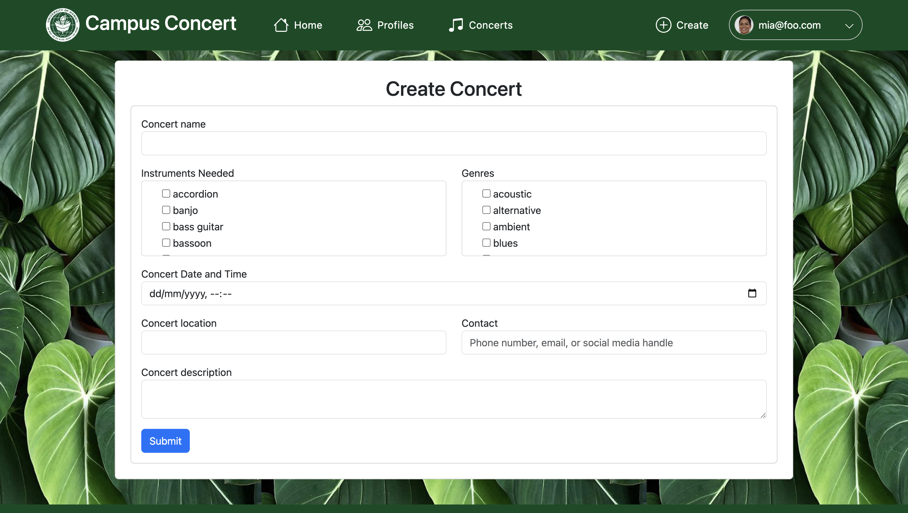
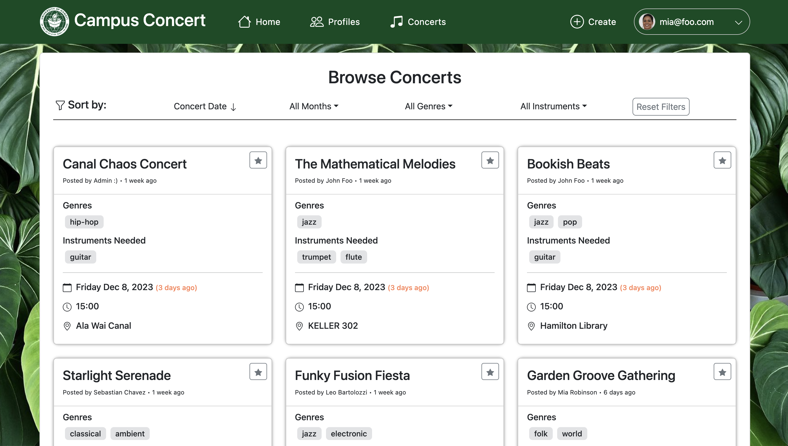
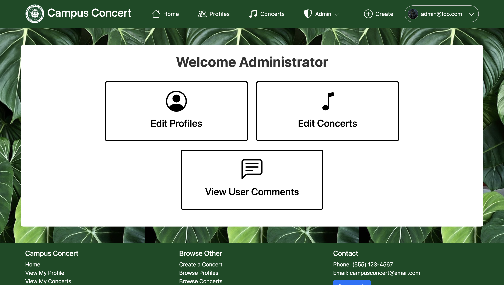

# Campus Concert
[](https://opensource.org/licenses/MIT)


Check out the app here: [campus-concert.com](https://campus-concert.com/)
## Table of contents

* [Overview](#overview)
* [User Guide](#user-guide)
* [Developer Guide](#developer-guide)
* [Development History](#development-history)
* [Deployment](#deployment)
* [Community Feedback](#community-feedback)
* [Team](#team)

## Overview

Campus Concert is a web application that allows musicians on campus to connect with each other. Students with musical talents will have the ability to easily discover like-minded peers, form connections based on shared musical tastes and abilities, and collaboratively engage in musical activities. 

This application aims to provide users the following features:
* Personalized profiles highlighting their instrumentation, musical tastes, and capabilities.
* The ability to browse through profiles of other musicians with filtering options based on musical tastes, capabilities, instruments, etc.
* The ability to create and schedule "concerts" or music sessions, including details like location, time, musical type, desired capabilities, and organizer contact information.

## User Guide

This section will provide a walkthrough of the Campus Concert user interface and its capabilities.

### Landing Page
The landing page serves as the initial webpage that users encounter. It briefly describes the features of the web app, and allows usrs to log in or register an account.<br>


### Sign in and Sign up
The sign-up feature enables new users to create an account using an email and password. Returning users can access their accounts through the sign-in feature by entering their registered email and password.<br>


### Create Profile
After successfully registering an account, new users are directed to this page to input profile information, including a name, profile picture, description, their musical preferences and instrumentation.<br>


### User Home Page
The home page welcomes users and displays an interface that offers easy navigation to various functionalities.<br>


### My Profile
The My Profile page showcases how a user's profile appears to others within the platform. It features a link for users to make edits and customize their profile.<br>


### Edit Profile
Users can easily update their information, add new details, or modify their profile picture.<br>


### Browse All Profiles
On the Browse Profiles page, users can discover a diverse range of profiles, which they can seamlessly navigate through by applying filters to refine their search.<br>


### View Profile
By clicking on a profile card, users can expand the details of other users' profiles to view their concerts.<br>


### Create Concert
Users can post and share music sessions called "Concerts." Within these posts, users can define the session's details such as location, time, genres and instruments involved.<br>


### My Concerts
The My Concerts page displays all Concerts created by the user.<br>


### Edit Concert
Users can easily update the information and add new details to their Concert posts or remove them entirely.<br>


### Browse Concerts Page
On the Browse Concerts page, users can explore other users' Concerts, which they can seamlessly navigate through by applying filters to refine their search.<br>


#### View Concert
By clicking on a Concert card, users can enlarge other users' Concert posts to view more details.<br>


### Bookmarked Concerts
Users can bookmark Concerts for future reference by clicking on the star icon within a Concert post. They can access and manage their bookmarks directly on this page.<br>


### Contact Form
The contact form serves as a convenient and secure means for users to reach out to our team. By filling out the form, users can submit inquiries, feedback, or requests.<br>


### Admin Home Page
The admin home page displays an interface that offers easy navigation to various admin-exclusive functionalities.<br>


### Admin: Browse Profiles and Concerts
These pages are nearly identical to user-side Browse Profiles and Browse Concerts pages. However, administrators have the authority to edit details for all user profiles and Concert posts.<br>


### View User Comments
The View User Comments page is the designated space where administrators can access and review the contact form submissions.<br>


## Developer Guide

### Installation

First, [install Meteor](https://www.meteor.com/install).

Second, clone the repository [Campus Concert](https://github.com/campus-consert/campus-consert) to your local computer.

Third, cd into the campus-concert/app directory and install libraries with:

```
$ meteor npm install
```

Fourth, run the system with:

```
$ meteor npm run start
```

If all goes well, the application will appear at [http://localhost:3000](http://localhost:3000).

### Application Technologies

The application is based upon [meteor-application-template-react](https://ics-software-engineering.github.io/meteor-application-template-react/) and the following technologies:
* [Meteor](https://www.meteor.com/) for Javascript-based implementation of client and server code.
* [React](https://reactjs.org/) for component-based UI implementation and routing.
* [React Bootstrap](https://react-bootstrap.github.io/) CSS Framework for UI design.
* [Uniforms](https://uniforms.tools/) for React form design and display.

## Development History

### Milestone 1:

[Milestone 1 Project Board](https://github.com/orgs/campus-concert/projects/2)

- The system is deployed to Digital Ocean
- Landing page
- Mockups of at least four other pages

### Milestone 2:

[Milestone 2 Project Board](https://github.com/orgs/campus-concert/projects/3)

- Create more pages
- Create tests

### Milestone 3:

[Milestone 3 Project Board](https://github.com/orgs/campus-concert/projects/4)

- Implement functionalities to improve user experience
- Clean up

## Deployment:

[https://campus-concert.com/](https://campus-concert.com/)

## Community Feedback:

<b><i>TBD.</i></b>

## Team

[Team Contract](https://docs.google.com/document/d/1Ckn2tzphzKtFnbybxNjpLsFNhzwq6GbyBl7eKxhJxuA/edit?usp=sharing)

Campus Concert is designed, implemented, and maintained by
* [Gerald Huff](https://codecraftsperson.github.io)
* [Matthew Kouchi](https://matthewtkouchi.github.io/)
* [Josiah Liu](https://josiahsliu.github.io)
* [Einar Midthun](https://einar-m.github.io/)
* [James Phan](https://jamesgphan.github.io)
* [Nicholas Takamatsu](https://nicktaka.github.io/)
